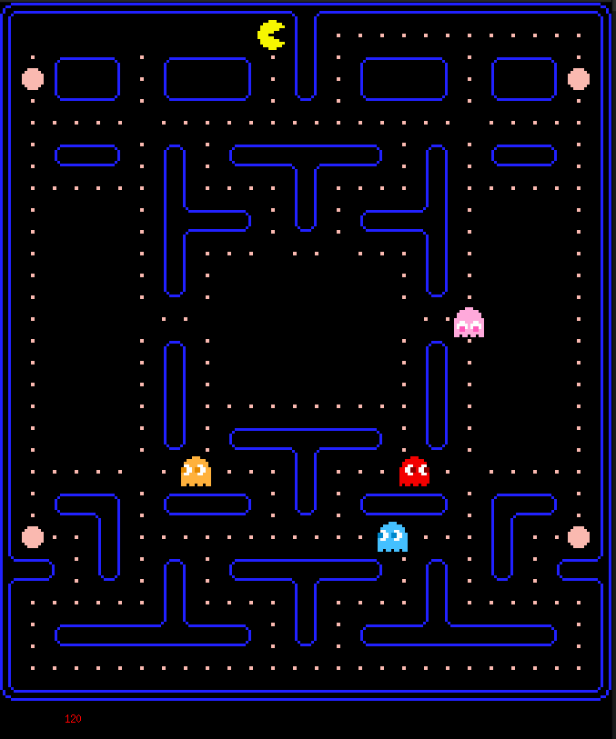
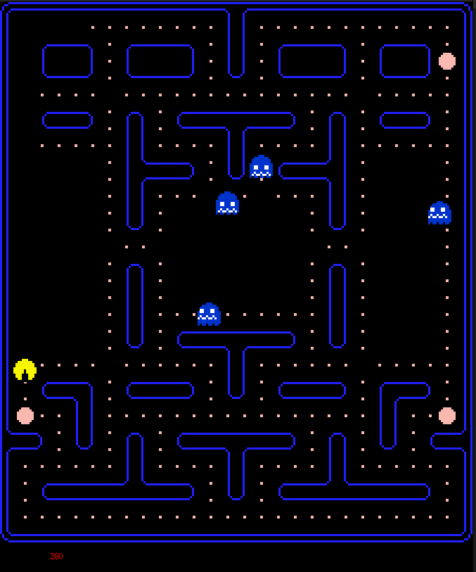
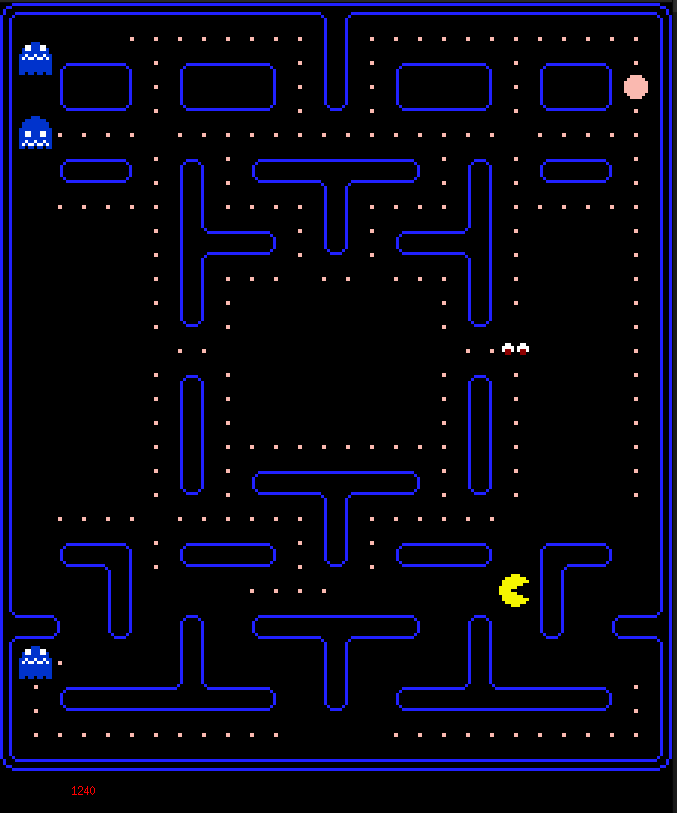

# 🟡 Pacman avec minilibx de 42 / *Pacman with 42's minilibx*

Un remake du jeu classique Pacman, réalisé entièrement en C en utilisant la minilibx de l'école 42. **Créez vos propres niveaux grâce à un simple fichier texte et découvrez une jouabilité améliorée avec des animations fluides et des mécaniques de jeu captivantes.**   

*A remake of the classic Pacman game, crafted entirely in C using the minilibx from 42 school. **Craft your own levels with a simple text file and experience enhanced gameplay with fluid animations and compelling game mechanics.***





## Création de niveaux personnalisés / *Custom Level Creation*
**Libérez votre créativité** en dessinant vos propres niveaux pour Pacman! La création de niveaux est simplifiée grâce à un système basé sur les fichiers texte. Chaque caractère dans le fichier texte représente un élément dans le jeu.

***Unleash your creativity** by designing your very own levels for Pacman! Level creation is made simple with a text file-based system. Each character in the text file represents an element in the game.*

### Légende des caractères
 - `1` : **Mur** - Cet endroit est inaccessible pour Pacman et les fantômes.
 - `0` : **Vide** - Un espace libre où Pacman et les fantômes peuvent se déplacer.
 - `S` : **Super Gomme** - Donne à Pacman le pouvoir de manger les fantômes.
 - `P` : **Pacman** - La position de départ de notre héros.
 - `B` : **Blinky** - Le fantôme rouge.
 - `C` : **Clyde** - Le fantôme orange.
 - `I` : **Inky** - Le fantôme bleu clair.
 - `p` : **Pinky** - Le fantôme rose.
### *Character Legend*
 - *`1` : **Wall** - This spot is inaccessible to Pacman and the ghosts.*
 - *`0` : **Empty Space** - A free space where Pacman and the ghosts can move.*
 - *`S` : **Super Pellet** - Empowers Pacman to eat the ghosts.*
 - *`P` : **Pacman** - Starting position of our hero.*
 - *`B` : **Blinky** - The red ghost.*
 - *`C` : **Clyde** - The orange ghost.*
 - *`I` : **Inky** - The light blue ghost.*
 - *`p` : **Pinky** - The pink ghost.*

 ### Exemple de niveau / *Sample Level*
```
11111111111
1000CBpI001
10000000001
10000000001
10000000001
10000000001
10000000001
10000S00001
10000000001
1P000000001
1S0000000S1
11111111111
```

## 🚀 Fonctionnalités
 - **Graphismes Retro** : Découvrez le charme de Pacman avec des graphismes pixelisés.
 - **Gestion de déplacement fluide** : Profitez d'une expérience de jeu réactive et fluide grâce à notre optimisation du déplacement.
 - **Animations dynamiques** : Les animations donnent vie à Pacman et à ses adversaires fantomatiques.
 - **Deux types de gommes** :
   - **Gomme normale** : La base du jeu. Mangez-les toutes pour passer au niveau suivant.
   - **Super Gomme** : Mangez cette gomme spéciale et regardez les fantômes devenir bleus et ralentir, vous donnant l'opportunité de les dévorer!
 - **Performances optimisées** : Grâce à C et à la minilibx de 42, le jeu fonctionne de manière fluide.
## 🚀 *Features*
 - ***Retro Graphics** : Relish the charm of Pacman with pixelated visuals.*
 - ***Fluid Movement Management** : Enjoy a responsive and seamless gaming experience with our movement optimization.*
 - ***Dynamic Animations** : Animations bring Pacman and his ghostly foes to life.*
 - ***Two types of pellets** :* 
   - ***Regular Pellet** : The bread and butter of the game. Eat all of them to proceed to the next level.*
   - ***Super Pellet** : Devour this special pellet and watch the ghosts turn blue and slow down, giving you a chance to gobble them up!*
 - ***Optimized Performance** : With C and 42's minilibx, the game runs smoothly.*

## 🔧 Pré-requis / *Prerequisites*

Installer les bibliotheque suivantes / *Install the following libraries* :

### Debian / Ubuntu:
```bash
sudo apt-get install xorg libxext-dev zlib1g-dev libbsd-dev
```

### Fedora:
```bash
sudo dnf install xorg-x11-server-Xorg libXext-devel zlib-devel libbsd-devel
```


### Arch Linux / Manjaro:
```bash
sudo pacman -S xorg-server libxext zlib libbsd
```


## 🛠 Installation

```bash
#### Clonez ce dépôt
# 1. Clone the repository
git clone https://github.com/alex-robert-fr/Pacman-so_long

# 2. Entrez dans le dossier du projet
#    Enter the project directory
cd Pacman-so_long

# 3. Compilez le jeu
#    Compile the game
make

# 4. Lancez le jeu avec une map en paramètre
#### Launch the game with a map as a parameter
./so_long map.ber
```

## 🎮 Comment jouer / How to Play

 - **Déplacez** Pacman avec les touches fléchées.
 - **Mangez** tous les points et gommes pour passer au niveau suivant.
 - **Evitez** les fantômes, sauf après avoir mangé une super gomme : ils deviennent alors votre proie.

 ---

 - ***Move** Pacman with the arrow keys.*
 - ***Eat** all the dots and pellets to move to the next level.*
 - ***Avoid** the ghosts, unless after having a super pellet: they then become your prey.*

## 📜 Licence / License

Ce projet est sous licence GPL-3.0. Voir le fichier LICENCE pour plus d'informations.
This project is licensed under GPL-3.0. See the LICENSE file for more details.
